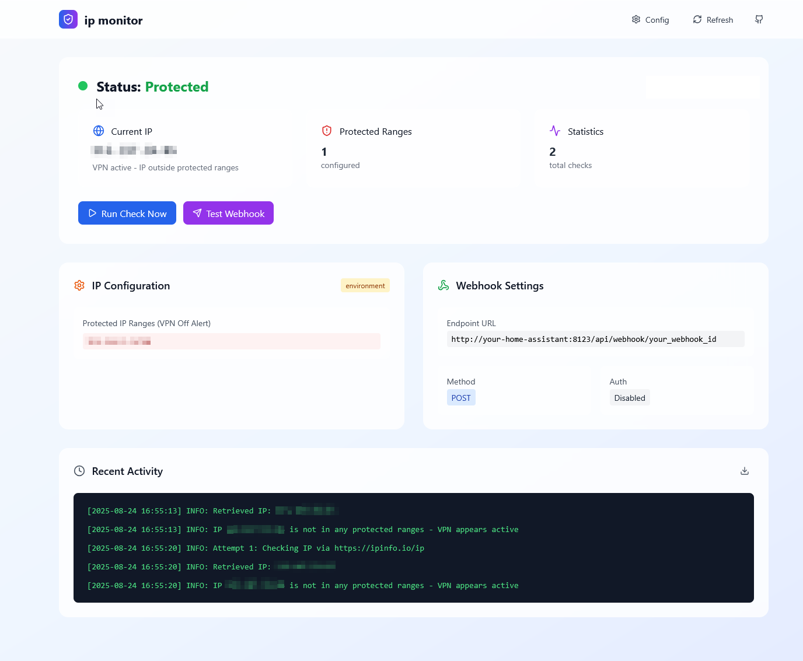

# (Tiny) IP Monitor

A lightweight IP monitoring service that alerts you when your public IP address is outside your configured safe ranges (e.g. when your VPN may or may not have been disabled). 



## Features

- Web-based configuration with environment-variable fallback
- Minimal resource usage (Alpine base)
- Configurable alert cooldowns to avoid noise
- Redundant IP detection services


## Quick Start

Get started quickly with the Docker (Compose) Image. 

### Docker Compose (recommended)

```yaml
services:
  ip-monitor:
    image: ghcr.io/hawkinslabdev/tiny-ip-monitor:latest
    container_name: ip-monitor
    ports:
      - "8082:8080"
    volumes:
      - ./data:/app/data
      - ./logs:/var/log
    healthcheck:
      test: ["CMD-SHELL", "wget -qO- http://localhost:8080/health || exit 1"]
      interval: 30s
      timeout: 5s
      retries: 3
    restart: unless-stopped
    environment:doc
      # Prefer using an .env file in production to avoid committing secrets. See the Configuration section below for available options
      - SAFE_IP_RANGE=192.168.1.0/24
      - WEBHOOK_URL=http://homeassistant.local:8123/api/webhook/your-id
      - WEBHOOK_METHOD=POST
      - CHECK_INTERVAL=12h
      - ALERT_COOLDOWN=1h
```

**Best practices**
- Pin image versions (e.g., `:2.x.y`) instead of `:latest`.
- Keep configuration and logs on persistent volumes.
- Use an `.env` file for secrets and environment overrides; never commit secrets.
- Keep the root filesystem read-only and drop capabilities when possible.
- Regularly pull and redeploy with updated images.

---

## Configuration

### Option A: Web UI (recommended)
1. Start the container without configuration env vars.
2. Open `http://localhost:8082` → **Configuration**.
3. Set safe IP ranges and webhook settings.
4. The configuration is saved to `./data/config.json`.

### Option B: Environment Variables (compose example)

```yaml
environment:
  - SAFE_IP_RANGE=192.168.1.0/24
  - APP_NAME="VPN Guardian"
  - WEBHOOK_URL=http://homeassistant.local:8123/api/webhook/your-id
  - WEBHOOK_METHOD=POST
  - CHECK_INTERVAL=12h
  - ALERT_COOLDOWN=1h
  # Optional:
  # - WEBHOOK_USER=username
  # - WEBHOOK_PASS=password
  # - CRON_SCHEDULE=0 */12 * * *
```

### Switching from env vars to file/Web configuration
1. In the web UI, use **Migrate to File Configuration**.
2. Remove the env vars from your compose file.
3. Restart the container.

### Configuration Options

| Setting          | Description                                      | Default        | Example                                 |
|------------------|--------------------------------------------------|----------------|-----------------------------------------|
| `APP_NAME`       | Display name of the application                  | `ip monitor`   | `VPN Guardian`, `Network Monitor`       |
| `SAFE_IP_RANGE`  | Comma-separated CIDR ranges for safe networks    | `192.168.1.0/24` | `192.168.1.0/24,10.0.1.0/24`           |
| `WEBHOOK_URL`    | Alert notification endpoint                      | None           | `http://ha.local:8123/api/webhook/id`   |
| `WEBHOOK_METHOD` | HTTP method for alerts                           | `POST`         | `POST`, `PUT`, `GET`                    |
| `WEBHOOK_USER`   | Basic auth username                              | None           | `username`                              |
| `WEBHOOK_PASS`   | Basic auth password                              | None           | `password`                              |
| `CHECK_INTERVAL` | How often to check IP                            | `12h`          | `6h`, `30m`, `2h30m`                    |
| `ALERT_COOLDOWN` | Minimum time between alerts                      | `1h`           | `30m`, `2h`                             |
| `CRON_SCHEDULE`  | Cron expression for checks                       | `0 */12 * * *` | `*/30 * * * *`                          |

## Webhook Integrations

### Home Assistant
```yaml
automation:
  - alias: "IP Monitor Alert"
    trigger:
      platform: webhook
      webhook_id: your-webhook-id
    action:
      service: notify.mobile_app_your_phone
      data:
        message: "{{ trigger.json.message }}"
```

### Discord
Use the webhook URL directly:
```
https://discord.com/api/webhooks/YOUR_WEBHOOK_ID/YOUR_TOKEN
```

### Slack
Use the incoming webhook URL:
```
https://hooks.slack.com/services/YOUR/SLACK/WEBHOOK
```

### Example Payload
```json
{
  "message": "ip monitor alert: Current IP 203.0.113.1 is not in any safe range.",
  "current_ip": "203.0.113.1",
  "safe_ranges": ["192.168.1.0/24"],
  "timestamp": "2025-01-09T14:30:22.123456",
  "alert_type": "unsafe_ip",
  "consecutive_alerts": 1
}
```

## License

AGPL 3.0 License – see `LICENSE` for details.

---

## Contributing

Issues and PRs are welcome, you probably know how to do that. 